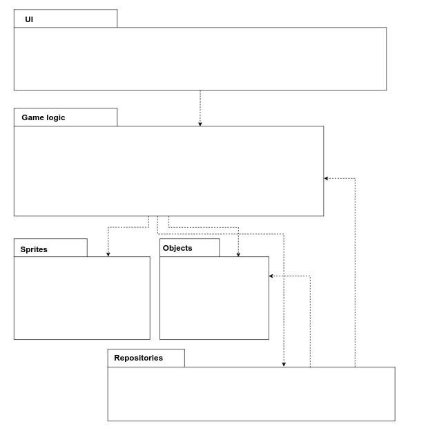
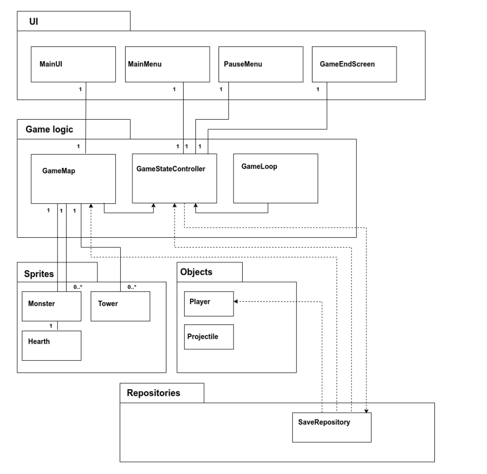
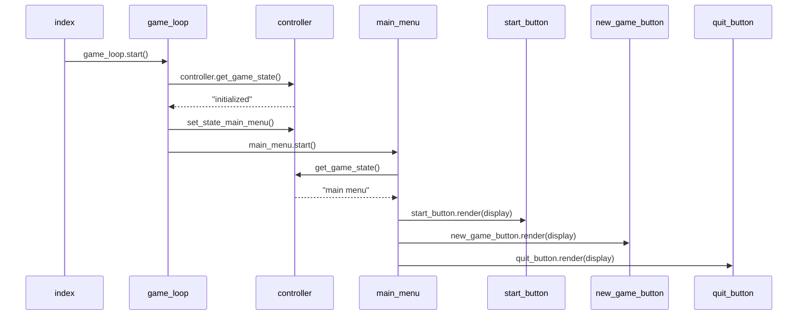
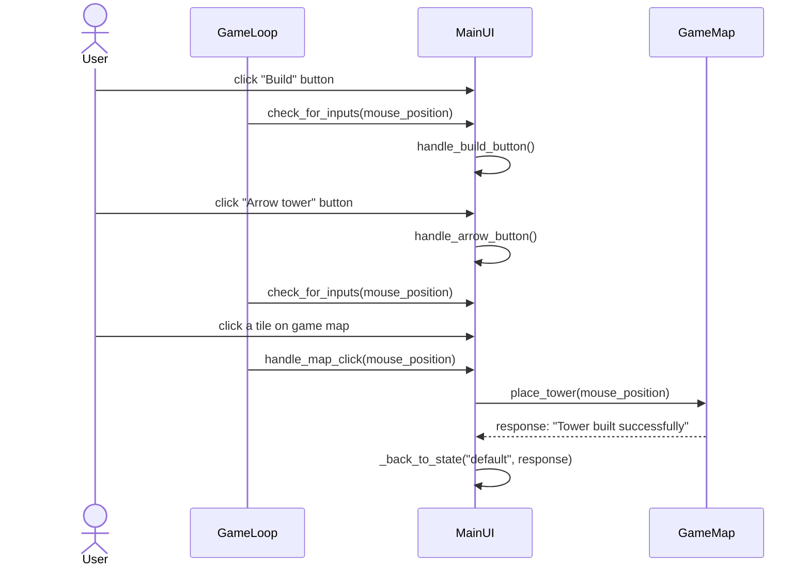
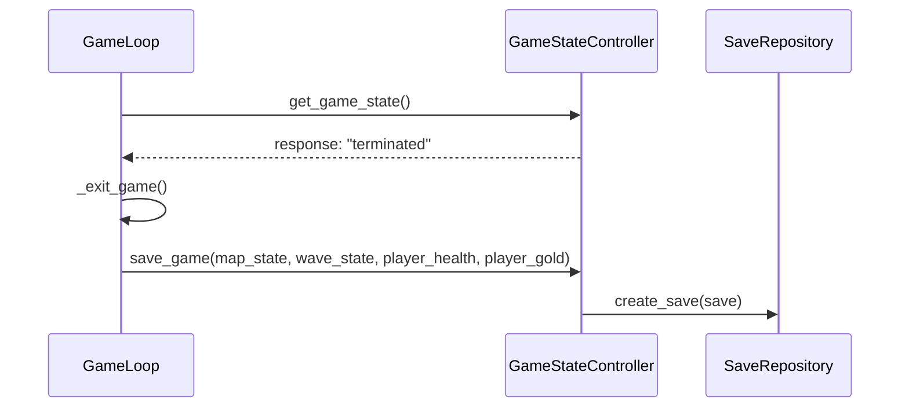

# Arkkitehtuurikuvaus

## Rakenne
Ohjelman rakenne koostuu käyttöliittymästä, pelilogiikasta, Sprite-olioista, muista
pelin tarvitsemista olioista sekä tiedon tallennuksesta vastaavasta SaveRepository-moduulista.

## Käyttöliittymä
Käyttöliittymä koostuu luokista:
- Päävalikko (MainMenu)
- Paussivalikko (PauseMenu)
- Lopetusruutu (GameEndScreen)
- Pääkäyttöliittymä (MainUI)

Valikoiden (MainMenu, PauseMenu ja GameEndScreen) avulla käyttäjä voi navigoida pelin eri tilojen välillä.
Siirtyminen eri tilojen välillä on toteutettu GameStateController-luokan avulla, jonka palveluita
eri valikot kutsuvat kun valikoiden nappeja painetaan.

Pääkäyttöliittymä näytetään pelikartan vieressä oikealla, kun peli on käynnissä. Sen kautta tehdään
suuri osa pelin toiminnoista, kuten tornien valitseminen ja niiden asettelu pelikartalle. Pääkäyttöliittymä
jakautuu pelikarttaan kohdistuviin toimintoihin sekä oikealla näytettävän valikon toimintoihin.
Pelikarttaan kohdistuvat toiminnot on toteutettu GameMap-luokan palveluina, kuten:

- `place_tower(self, mouse_position, tower_type)`
- `select_tower(self, mouse_position)`

Valikon toiminnot muuttavat valikon tilaa, kuten valitsevat seuraavaksi rakennettavan tornin
tai käynnistävät seuraavan hirviöaallon. Pelin tilaan liittyvät toiminnot on toteutettu
GameStateController-luokan palveluina.

## Sovelluslogiikka
Tarkempi kuvaus sovelluksen rakenteesta ja sen eri osien
välisistä suhteista luokka/pakkauskaaviona:

### Sovelluslogiikan tärkeimmät luokat
Pelin toiminnallisista kokonaisuuksista vastaavat pääosin
seuraavat luokat:
#### GameMap

GameMap-luokka vastaa pelikartasta ja siihen liittyvistä palveluista joita käyttöliittymä tarvitsee. Pelikartta 
on toteutettu matriisina, jonka alkioita Sprite-luokan oliot Floor, Ground ja Hearth ovat.

GameMap-luokka hallinnoi kaikkea pelikartalla näkyvää ja vastaa pelikartan päivittämisestä, erityisesti 
se hallinnoi Sprite-luokan olioita. Luokassa toteutettu funktio `update(current_time)` käyttää Sprite-olioiden toimintoja, kuten:
- `monster.move(self, current_time)`
- `monster.update_status(current_time)`
- `tower.should_shoot(current_time)`
- `tower.shoot_nearest_monster(self.monsters, self.projectiles, current_time)`
- `projectile.update()`

Funktion avulla siis esimerkiksi liikutetaan hirviöitä ja tornien ammuksia pelikartalla. `update(current_time)`-funktiota kutsutaan
pelisilmukasta.

Käyttöliittymää varten toteutettuja palveluja ovat:
- `place_tower(self, mouse_position, tower_type)`
- `select_tower(self, mouse_position)`

#### GameLoop

GameLoop-luokka on sovelluksen pelisilmukka. Sen toimintaperiaatteena on, että pelisilmukka kysyy GameStateController-oliolta pelin tilaa
funktiolla `get_game_state()`, ja vastauksesta riippuen joko siirrytään suorittamaan seuraavaa tilaa tai
jatketaan varsinaisen pelisilmukan suoritusta.

Luokassa toteutettuja funktiota ovat:
- `_render(self)`
- `_handle_events()`

#### GameStateController
GameStateController-luokassa on toteutettu pelin tilat ja palvelut niiden hallintaan muille luokille, erityisesti käyttöliittymälle.
Luokassa on toteutettu myös hirviöaaltoihin liittyvä toiminnallisuus.

Pelin tilaan liittyviä palveluja:
- `set_state_main_menu(self)`
- `set_state_paused(self)`
- `set_state_game_over`

Hirviöaaltoihin liittyviä palveluja:
- `should_spawn_monster(current_time)`
- `get_next_monster_type(self)`

## Tietojen pysyväistallennus

Sovelluksessa on toteutettuna tallennustoiminto, johon käytetään SQLite-tietokantaa. Tallennuksesta vastaa
repositories-pakkauksen luokka SaveRepository. Tallennustoiminnon avulla säilötään pelin tila niin, että kesken
jääneestä pelistä voidaan jatkaa myöhemmin.

Luokan palveluja ovat:
- `find_save()`
- `create_save(save)`
- `delete_all_saves(save)`

Pelin käynnistyessä setup-moduulin avulla ladataan tallennuksen tiedot. Kun peli suljetaan, käytetään
SaveRepositoryn palvelua  `create_save(save)`ja tallennetaan tarvittavat tiedot pelin tilasta tietokantaan.

## Päätoiminnot

Sovelluksen päätoiminnallisuudet kuvattuna sekvenssikaavioina.

#### Pelin käynnistys

Sekvenssikaaviossa on kuvattuna tilanne jossa ohjelma käynnistetään. Ensin 
käynnistetään pelisilmukka, jonka jälkeen siirrytään päävalikkoon.

#### Tornin rakentaminen pelikartalle
Sekvenssikaaviossa on kuvattuna tilanne, jossa käyttäjä rakentaa tornin pelikartalle
kolmella klikkauksella. Ensin käyttäjä painaa MainUI:n nappia "Build", sitten MainUI:n 
nappia "Arrow" valitakseen tornin ja viimeiseksi klikkaa pelikartalla kohtaa, johon haluaa rakentaa tornin.
GameLoop tunnistaa klikkaukset, ja siirtää ne MainUI:lle käsiteltäväksi. MainUI käyttää
GameMap-oliolta funktiota `place_tower(mouse_position)` joka asettaa tornin pelikartalle. Lopuksi
MainUI palaa takaisin "default"-tilaan.

#### Tallennustoiminto
Sekvenssikaaviona kuvattuuna tilanne, jossa sovelluksen sulkemisen yhteydessä tiedot pelin tilasta tallennetaan
SaveRepositoryn avulla SQLite-tietokantaan. 

