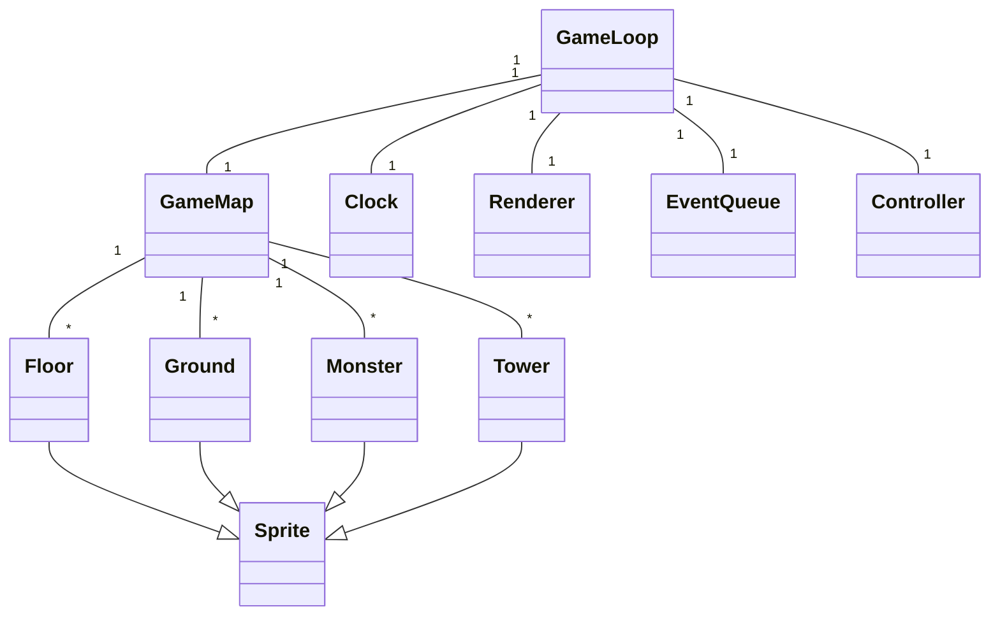
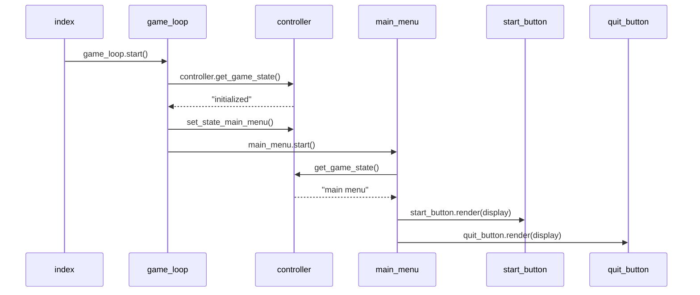

# Arkkitehtuurikuvaus

```mermaid
 classDiagram
      GameMap "1"--"*" Floor
      GameMap "1"--"*" Ground
      GameMap "1"--"*" Monster
      GameMap "1"--"*" Tower

      GameLoop "1"--"1" GameMap
      GameLoop "1"--"1" Clock
      GameLoop "1"--"1" Renderer
      GameLoop "1"--"1" EventQueue
      GameLoop "1"--"1" Controller

      Floor --|> Sprite
      Ground --|> Sprite
      Monster --|> Sprite
      Tower --|> Sprite

      class Sprite{
      }
      class Floor{
      }
      class Ground{
      }
      class Monster{
      }
      class Tower{
      }
      class GameLoop{
      }
      class GameMap{
      }
      class Clock{
      }
      class Renderer{
      }
      class EventQueue{
      }
      class Sprite{
      }
      class Controller{
      }
```
### Pelin käynnistys
Sekvenssikaaviossa on kuvattuna tilanne jossa ohjelma käynnistetään. Ensin 
käynnistetään pelisilmukka, jonka jälkeen siirrytään päävalikkoon.

```mermaid
 sequenceDiagram
      index->>game_loop: game_loop.start()
      game_loop->>controller: controller.get_game_state()
      controller-->>game_loop: "initialized"
      game_loop->>controller: set_state_main_menu()
      game_loop->>main_menu: main_menu.start()
      main_menu->>controller: get_game_state()
      controller-->>main_menu: "main menu"
      main_menu->>start_button: start_button.render(display)
      main_menu->>quit_button: quit_button.render(display)
```