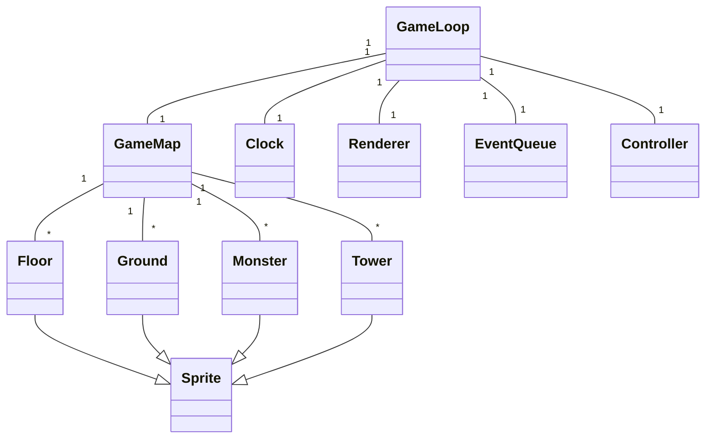

```mermaid
 classDiagram
      GameMap "1"--"*" Floor
      GameMap "1"--"*" Ground
      GameMap "1"--"*" Monster
      GameMap "1"--"*" Tower

      GameLoop "1"--"1" GameMap
      GameLoop "1"--"1" Clock
      GameLoop "1"--"1" Renderer
      GameLoop "1"--"1" EventQueue
      GameLoop "1"--"1" Controller

      Floor --|> Sprite
      Ground --|> Sprite
      Monster --|> Sprite
      Tower --|> Sprite

      class Sprite{
      }
      class Floor{
      }
      class Ground{
      }
      class Monster{
      }
      class Tower{
      }
      class GameLoop{
      }
      class GameMap{
      }
      class Clock{
      }
      class Renderer{
      }
      class EventQueue{
      }
      class Sprite{
      }
      class Controller{
      }
```