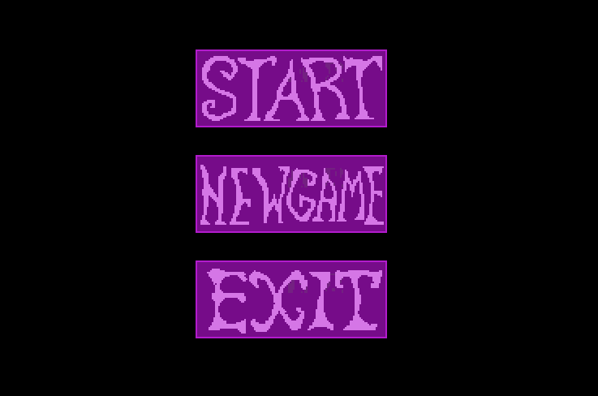
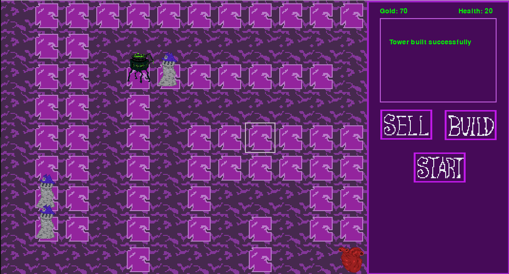
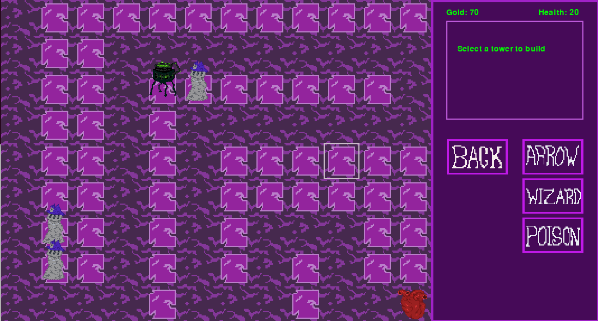

## Käyttöohje
Lataa ohjelman viimeisin release [täältä](https://github.com/user7888/ot-harjoitustyo/releases).

### Ohjelman käynnistys
1. Kun olet purkanut ohjelman, siirry ohjelman hakemistoon ja asenna riippuvuudet komennolla:
```
poetry install
```

2. Suorita seuraavaksi alustustoimenpiteet komennolla:
```
poetry run invoke init
```

3. Ja lopuksi käynnistä sovellus komennolla:
```
poetry run invoke start
```

### Pelin aloittaminen
Kun sovellus käynnistetään, käyttäjälle näytetään päävalikko.


- "Start"-nappi käynnistää pelin, ja jatkaa löytyneestä tallennuksesta jos tallennus löytyy.
- "New Game"-nappi aloittaa aina uuden pelin tuoreesta tallennuksesta. 
- "Quit"-nappi sulkee pelin.

### Päänäkymä
Kun peli käynnistetään, avautuu käyttäjälle pelin päänäkymä. Vasemmalla on pelikartta,
jolla hirviöt liikkuvat ja jolle torneja rakennetaan. Oikealla on pääkäyttöliittymä.

- "Sell"-napilla myydään torneja. Torni myydään painamalla ensin "Sell"-nappia ja 
  sen jälkeen sitä tornia kartalla, joka halutaan myydä.
- "Build"-napin kautta tapahtuu tornien rakentaminen.
- "Start"-nappi käynnistää hirviöaallon. 

### Tornin valitseminen ja rakentaminen
Kuvassa näytetään tilanne, jossa käyttäjä on painanut "Build"-nappia.

Valikossa näytetään eri tornit (Arrow, Wizard, Poison) jota painamalla käyttäjä valitsee
rakennettavan tornin. Sen jälkeen käyttäjä voi pelikarttaa klikkaamalla
rakentaa tornin pelikartalle haluamaansa kohtaan.


