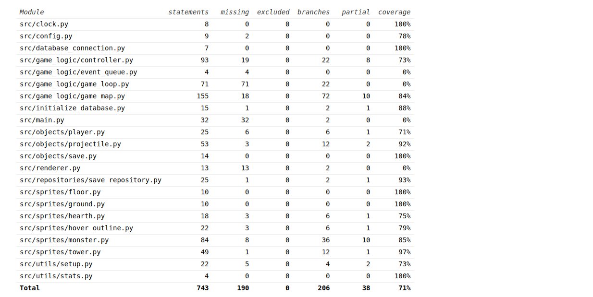

## Testausdokumentti
Ohjelman toimintaa on testattu unittest-kirjaston avulla toteutetuilla automatisoiduilla testeillä. Ohjelman toimintaa on myös testattu manuaalisesti ja se on testattu toimivaksi laitoksen koneella.

### Yksikkö- ja integraatiotestaus

#### Testikattavuus

Kuvassa testikattavuusraportti loppupalautuksen releasesta. Käyttöliittymä on jätetty kokonaan testien ulkopuolelle.

