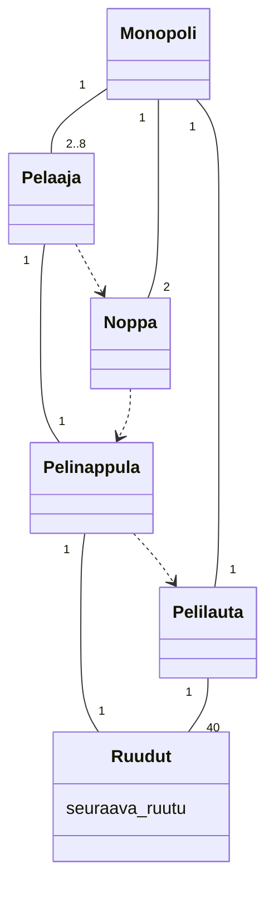

```mermaid
 classDiagram
      Monopoli "1" -- "2..8" Pelaaja
      Pelaaja "1" -- "1" Pelinappula
      Monopoli "1" -- "2" Noppa

      Pelilauta "1" -- "1" Monopoli
      Noppa "" ..> "" Pelinappula
      Pelinappula "1" -- "1" Ruudut
      Pelilauta "1" -- "40" Ruudut
      Pelaaja "" ..> "" Noppa
      Pelinappula "" ..> "" Pelilauta

      
      class Monopoli{
      }
      class Pelaaja{
      }
      class Pelilauta{
      }
      class Ruudut{
        seuraava_ruutu
      }
      class Pelinappula{
      }
      class Noppa{
      }
```