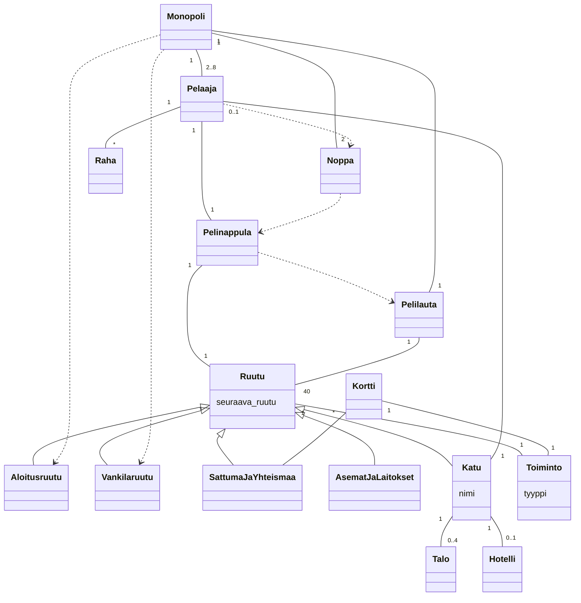

```mermaid
 classDiagram
      Monopoli "1" -- "2..8" Pelaaja
      Pelaaja "1" -- "1" Pelinappula
      Monopoli "1" -- "2" Noppa

      Pelilauta "1" -- "1" Monopoli
      Noppa "" ..> "" Pelinappula
      Pelinappula "1" -- "1" Ruutu
      Pelilauta "1" -- "40" Ruutu
      Pelaaja "" ..> "" Noppa
      Pelinappula "" ..> "" Pelilauta

      Ruutu <|-- Aloitusruutu
      Ruutu <|-- Vankilaruutu
      Ruutu <|-- SattumaJaYhteismaa
      Ruutu <|-- AsematJaLaitokset
      Ruutu <|-- Katu
      Monopoli "" ..> "" Aloitusruutu
      Monopoli "" ..> "" Vankilaruutu
      Ruutu "1" -- "1" Toiminto
      Kortti "*" -- "1" SattumaJaYhteismaa
      Kortti "1" -- "1" Toiminto
      Katu "1" -- "0..4" Talo
      Katu "1" -- "0..1" Hotelli
      Pelaaja "1" -- "*" Raha
      Katu "1" -- "0..1" Pelaaja

      
      class Monopoli{
      }
      class Pelaaja{
      }
      class Pelilauta{
      }
      class Pelinappula{
      }
      class Noppa{
      }

      class Ruutu{
        seuraava_ruutu
      }

      class Aloitusruutu{
      }
      class Vankilaruutu{
      }
      class SattumaJaYhteismaa{
      }
      class AsematJaLaitokset{
      }
      class Katu{
        nimi
      }
      class Toiminto{
        tyyppi
      }
      class Kortti{
      }
      class Talo{
      }
      class Hotelli{
      }
      class Raha{
      }
```