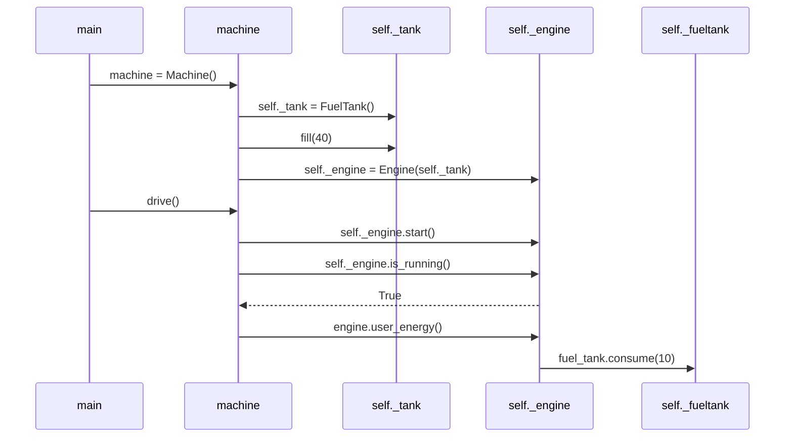

```mermaid
 sequenceDiagram
      main->>machine: machine = Machine()
      machine->>self._tank: self._tank = FuelTank()
      machine->>self._tank: fill(40)
      machine->>self._engine: self._engine = Engine(self._tank)
      main->>machine: drive()
      machine->>self._engine: self._engine.start()
      machine->>self._engine: self._engine.is_running()
      self._engine-->>machine: True
      machine->>self._engine: engine.user_energy()
      self._engine->>self._fueltank: fuel_tank.consume(10)
```