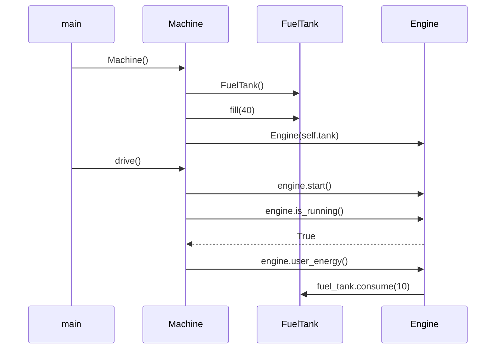

```mermaid
 sequenceDiagram
      main->>Machine: Machine()
      Machine->>FuelTank: FuelTank()
      Machine->>FuelTank: fill(40)
      Machine->>Engine: Engine(self.tank)
      main->>Machine: drive()
      Machine->>Engine: engine.start()
      Machine->>Engine: engine.is_running()
      Engine-->>Machine: True
      Machine->>Engine: engine.user_energy()
      Engine->>FuelTank: fuel_tank.consume(10)

```